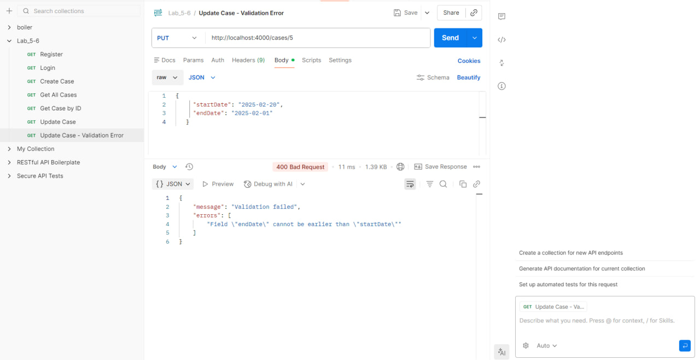
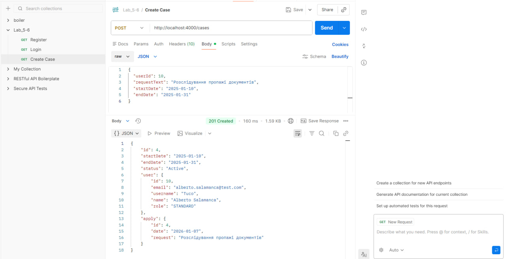
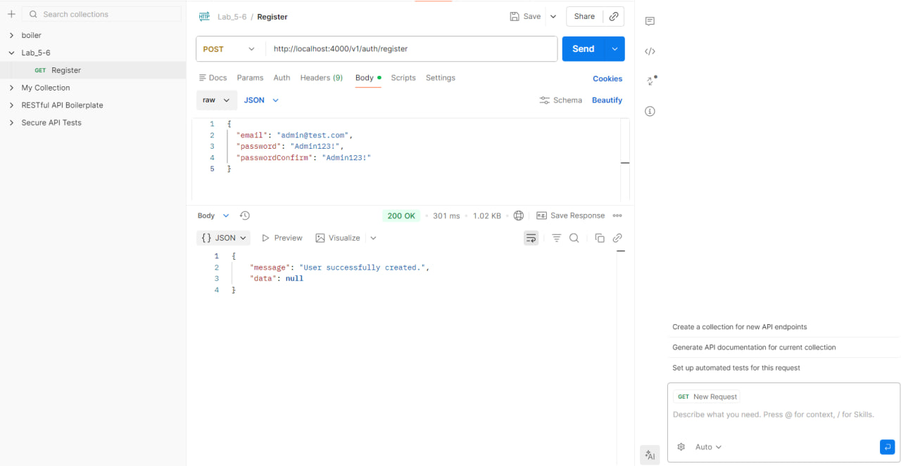
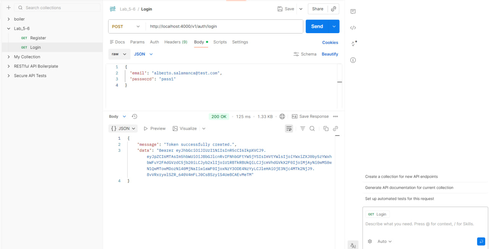
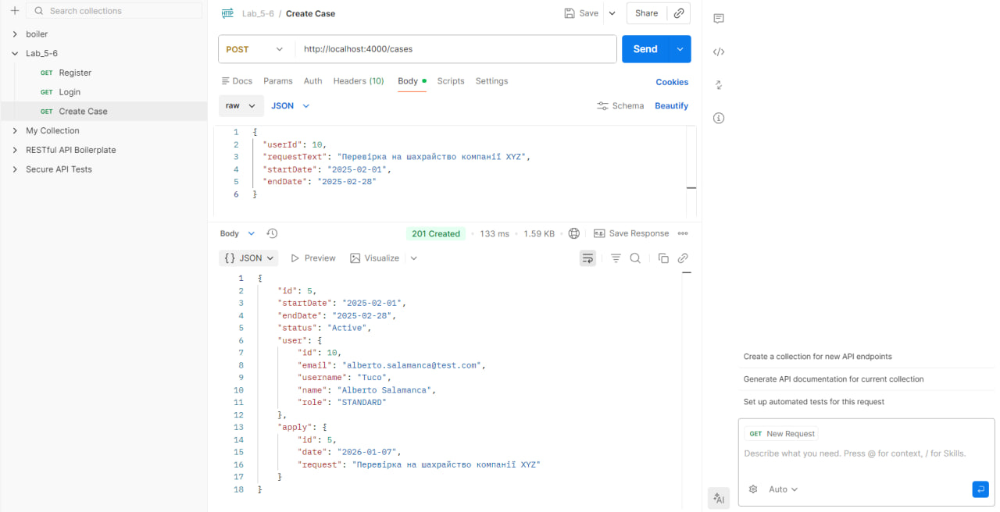
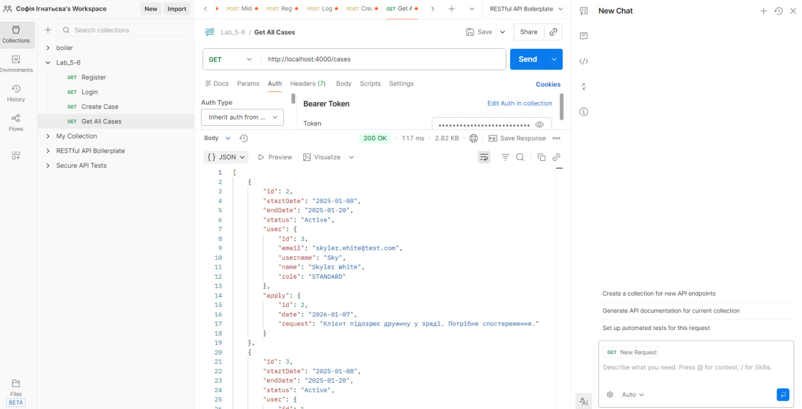
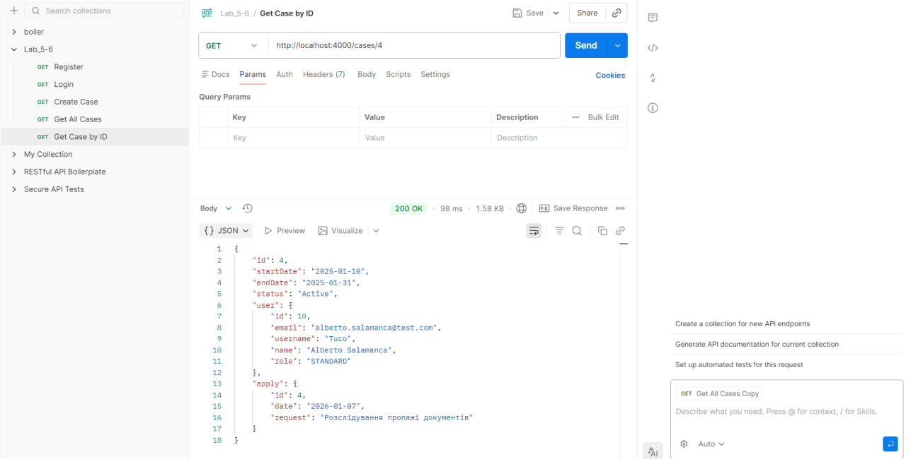
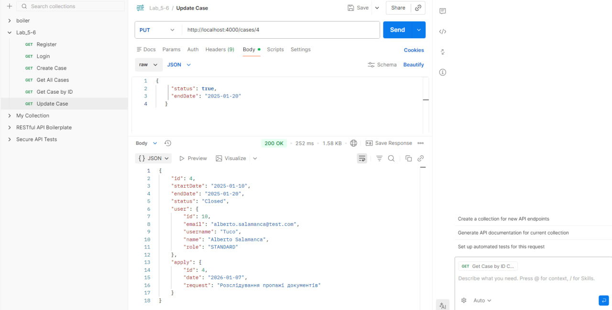
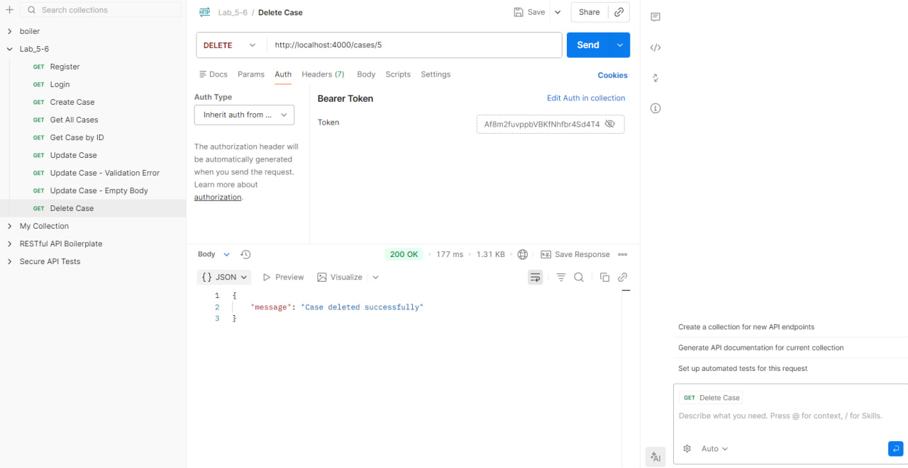
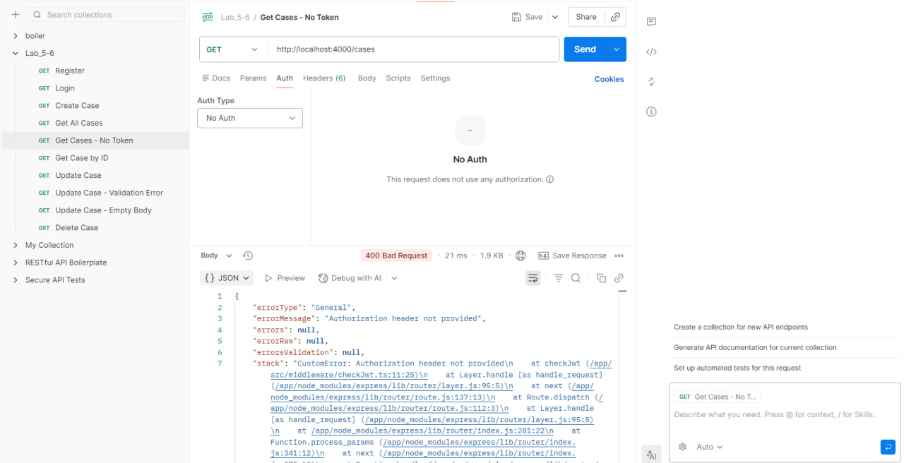

#  TypeORM / Express / TypeScript RESTful API boilerplate

[![CI][build-badge]][build-url]
[![TypeScript][typescript-badge]][typescript-url]
[![prettier][prettier-badge]][prettier-url]


Boilerplate with focus on best practices and painless developer experience:

- Minimal setup that can be extended 🔧
- Spin it up with single command 🌀
- TypeScript first
- RESTful APIs
- JWT authentication with role based authorization

## Requirements

- [Node v16+](https://nodejs.org/)
- [Docker](https://www.docker.com/)

## Running

_Easily set up a local development environment with single command!_

- clone the repo
- `npm run docker:dev` 🚀

Visit [localhost:4000](http://localhost:4000/) or if using Postman grab [config](/postman).

### _What happened_ 💥

Containers created:

- Postgres database container seeded with 💊 Breaking Bad characters in `Users` table (default credentials `user=walter`, `password=white` in [.env file](./.env))
- Node (v16 Alpine) container with running boilerplate RESTful API service
- and one Node container instance to run tests locally or in CI

## Features:

- [Express](https://github.com/expressjs/express) framework
- [TypeScript v4](https://github.com/microsoft/TypeScript) codebase
- [TypeORM](https://typeorm.io/) using Data Mapper pattern
- [Docker](https://www.docker.com/) environment:
  - Easily start local development using [Docker Compose](https://docs.docker.com/compose/) with single command `npm run docker:dev`
  - Connect to different staging or production environments `npm run docker:[stage|prod]`
  - Ready for **microservices** development and deployment.  
    Once API changes are made, just build and push new docker image with your favourite CI/CD tool  
    `docker build -t <username>/api-boilerplate:latest .`  
    `docker push <username>/api-boilerplate:latest`
  - Run unit, integration (or setup with your frontend E2E) tests as `docker exec -ti be_boilerplate_test sh` and `npm run test`
- Contract first REST API design:
  - never break API again with HTTP responses and requests payloads using [type definitions](./src/types/express/index.d.ts)
  - Consistent schema error [response](./src/utils/response/custom-error/types.ts). Your frontend will always know how to handle errors thrown in `try...catch` statements 💪
- JWT authentication and role based authorization using custom middleware
- Set local, stage or production [environmental variables](./config) with [type definitions](./src/types/ProcessEnv.d.ts)
- Logging with [morgan](https://github.com/expressjs/morgan)
- Unit and integration tests with [Mocha](https://mochajs.org/) and [Chai](https://www.chaijs.com/)
- Linting with [ESLint](https://eslint.org/)
- [Prettier](https://prettier.io/) code formatter
- Git hooks with [Husky](https://github.com/typicode/husky) and [lint-staged](https://github.com/okonet/lint-staged)
- Automated npm & Docker dependency updates with [Renovate](https://github.com/renovatebot/renovate) (set to patch version only)
- Commit messages must meet [conventional commits](https://www.conventionalcommits.org/en/v1.0.0/) format.  
  After staging changes just run `npm run commit` and get instant feedback on your commit message formatting and be prompted for required fields by [Commitizen](https://github.com/commitizen/cz-cli)

---

## Лабораторні роботи №5-6: Detective Agency System

### Предметна область

Система управління детективними справами з трьома основними сутностями:

- **User (Користувач)** – детективи та адміністратори системи з двома ролями: STANDARD (детективи) та ADMINISTRATOR.
- **Case (Справа)** – детективні справи з датами розслідування (startDate, endDate) та статусом (Active/Closed). Кожна справа належить одному користувачу.
- **Apply (Заявка)** – заявки клієнтів з описом проблеми. Кожна справа має одну заявку, яка описує суть запиту.

Усі сутності створені через міграції (`src/orm/migrations/1767753484485-AddDetectiveTables.ts`) та заповнені тестовими даними (`src/orm/seeds/1590519635401-SeedUsers.ts`).


**Зв'язки:**
- User ↔ Case: One-to-Many (один користувач має багато справ)
- Case ↔ Apply: One-to-One (одна справа має одну заявку)

---

## API Endpoints (Лаб №5)

### Аутентифікація

| Метод | Endpoint | Опис |
|-------|----------|------|
| POST | `/v1/auth/login` | Вхід та отримання JWT токену |
| POST | `/v1/auth/register` | Реєстрація нового користувача |
| POST | `/v1/auth/change-password` | Зміна пароля (потрібен JWT) |

### Cases (захищено JWT)

| Метод | Endpoint | Опис | Доступ |
|-------|----------|------|--------|
| POST | `/cases` | Створення нової справи | Authenticated |
| GET | `/cases` | Отримання всіх справ | Authenticated |
| GET | `/cases/:id` | Отримання однієї справи | Authenticated |
| PUT | `/cases/:id` | Оновлення справи | Authenticated |
| DELETE | `/cases/:id` | Видалення справи | ADMINISTRATOR |

Усі endpoints повертають дані з JOIN'ами (вкладені об'єкти user та apply)!**

### Приклад відповіді з JOIN'ами

**GET /cases/4**

```json
{
  "id": 4,
  "startDate": "2025-01-10",
  "endDate": "2025-01-31",
  "status": "Active",
  "user": {
    "id": 10,
    "email": "alberto.salamanca@test.com",
    "username": "Tuco",
    "name": "Alberto Salamanca",
    "role": "STANDARD"
  },
  "apply": {
    "id": 4,
    "date": "2026-01-07",
    "request": "Розслідування пропажі документів"
  }
}
```

**Не просто `userId: 10` та `applyId: 4`, а повні об'єкти з усіма даними!** 

---

## Архітектура додатку (Лаб №6)

Для підтримки чистого коду контролерів ми використовуємо три явні шари:

- **Middleware Validation** – наприклад, `src/middleware/validation/validatorCreateCase.ts` перевіряє обов'язкові поля, формати дат та бізнес-правила _до того_, як контролер виконається.
- **Controllers** – тільки оркестрація запитів. Вони створюють екземпляр сервісу, передають вже валідовані дані та формують HTTP відповідь.
- **Services** – вся бізнес-логіка та доступ до репозиторію (TypeORM) знаходиться тут. Кожна сутність має один сервіс (`src/services/**`), який приховує деталі персистентності від контролерів.
- **Repositories/DataSource** – керуються виключно сервісами через TypeORM Active Record або `getRepository`, тримаючи доступ до даних ізольованим.


---

## Приклади коду (Лаб №6)

### Приклад middleware

```typescript
// src/middleware/validation/validatorUpdateCase.ts
import { NextFunction, Request, Response } from 'express';
import validator from 'validator';

export const validatorUpdateCase = (req: Request, res: Response, next: NextFunction) => {
  const { startDate, endDate, status } = req.body;
  const errors: string[] = [];
  
  if (!startDate && !endDate && status === undefined) {
    errors.push('At least one field must be provided for update (startDate, endDate, or status)');
  }
  
  if (startDate !== undefined) {
    if (!validator.isDate(startDate)) {
      errors.push('Field "startDate" must be a valid date (YYYY-MM-DD)');
    }
  }
  
  if (endDate !== undefined) {
    if (!validator.isDate(endDate)) {
      errors.push('Field "endDate" must be a valid date (YYYY-MM-DD)');
    }
  }
  
  if (startDate && endDate) {
    const start = new Date(startDate);
    const end = new Date(endDate);

    if (end < start) {
      errors.push('Field "endDate" cannot be earlier than "startDate"');
    }
  }
  
  if (errors.length > 0) {
    return res.status(400).json({
      message: 'Validation failed',
      errors,
    });
  }

  return next();
};
```

### Приклад DTO

```typescript
// src/dto/CaseResponseDTO.ts
import { Case } from '../orm/entities/Case';

export class CaseResponseDTO {
  id: number;
  startDate: string;
  endDate: string;
  status: string;

  user: {
    id: number;
    email: string;
    username: string | null;
    name: string | null;
    role: string;
  } | null;

  apply: {
    id: number;
    date: string;
    request: string;
  } | null;

  constructor(caseEntity: Case) {
    this.id = caseEntity.id;
    this.startDate = caseEntity.startDate;
    this.endDate = caseEntity.endDate;
    this.status = caseEntity.status ? 'Closed' : 'Active';
    
    if (caseEntity.user) {
      this.user = {
        id: caseEntity.user.id,
        email: caseEntity.user.email,
        username: caseEntity.user.username,
        name: caseEntity.user.name,
        role: caseEntity.user.role,
      };
    } else {
      this.user = null;
    }
    
    if (caseEntity.apply) {
      this.apply = {
        id: caseEntity.apply.id,
        date: caseEntity.apply.date,
        request: caseEntity.apply.request,
      };
    } else {
      this.apply = null;
    }
  }
}
```

### Приклад Service

```typescript
// src/services/CaseService.ts
import { getRepository } from 'typeorm';
import { Apply } from '../orm/entities/Apply';
import { Case } from '../orm/entities/Case';
import { User } from '../orm/entities/users/User';

export class CaseService {
  public async create(data: {
    userId: number;
    requestText: string;
    startDate: string;
    endDate: string;
  }): Promise<Case> {
    const { userId, requestText, startDate, endDate } = data;
    
    const userRepo = getRepository(User);
    const user = await userRepo.findOne({ where: { id: userId } });

    if (!user) {
      throw new Error(`User with id ${userId} not found`);
    }
    
    const newApply = Apply.create({
      date: new Date().toISOString().split('T')[0],
      request: requestText,
    });
    await newApply.save();
    
    const newCase = Case.create({
      startDate: startDate,
      endDate: endDate,
      status: false,
      user: user,
      apply: newApply,
    });
    await newCase.save();
    
    return (await Case.findOne({
      where: { id: newCase.id },
      relations: ['user', 'apply'],
    })) as Case;
  }

  public async delete(id: number): Promise<void> {
    const caseToDelete = await Case.findOne({
      where: { id },
      relations: ['apply'],
    });

    if (!caseToDelete) {
      throw new Error(`Case with id ${id} not found`);
    }

    const applyId = caseToDelete.apply?.id;
    
    await caseToDelete.remove();

    if (applyId) {
      const applyToDelete = await Apply.findOne({ where: { id: applyId } });
      if (applyToDelete) {
        await applyToDelete.remove();
      }
    }
  }
}
```

---

## Postman докази роботи

### Помилка валідації (middleware блокує некоректний payload)



**Запит:**
```json
{
  "startDate": "2025-02-20",
  "endDate": "2025-02-01"
}
```

**Відповідь (400 Bad Request):**
```json
{
  "message": "Validation failed",
  "errors": [
    "Field \"endDate\" cannot be earlier than \"startDate\""
  ]
}
```

### Успішна відповідь з JOIN'ами (DTO у відповіді)



**Відповідь (201 Created):**
```json
{
  "id": 4,
  "startDate": "2025-01-10",
  "endDate": "2025-01-31",
  "status": "Active",
  "user": {
    "id": 10,
    "email": "alberto.salamanca@test.com",
    "username": "Tuco",
    "name": "Alberto Salamanca",
    "role": "STANDARD"
  },
  "apply": {
    "id": 4,
    "date": "2026-01-07",
    "request": "Розслідування пропажі документів"
  }
}
```











## Other awesome boilerplates:

Each boilerplate comes with it's own flavor of libraries and setup, check out others:

- [Express and TypeORM with TypeScript](https://github.com/typeorm/typescript-express-example)
- [Node.js, Express.js & TypeScript Boilerplate for Web Apps](https://github.com/jverhoelen/node-express-typescript-boilerplate)
- [Express boilerplate for building RESTful APIs](https://github.com/danielfsousa/express-rest-es2017-boilerplate)
- [A delightful way to building a RESTful API with NodeJs & TypeScript by @w3tecch](https://github.com/w3tecch/express-typescript-boilerplate)

[build-badge]: https://github.com/mkosir/express-typescript-typeorm-boilerplate/actions/workflows/main.yml/badge.svg
[build-url]: https://github.com/mkosir/express-typescript-typeorm-boilerplate/actions/workflows/main.yml
[typescript-badge]: https://badges.frapsoft.com/typescript/code/typescript.svg?v=101
[typescript-url]: https://github.com/microsoft/TypeScript
[prettier-badge]: https://img.shields.io/badge/code_style-prettier-ff69b4.svg
[prettier-url]: https://github.com/prettier/prettier

## Contributing

All contributions are welcome!